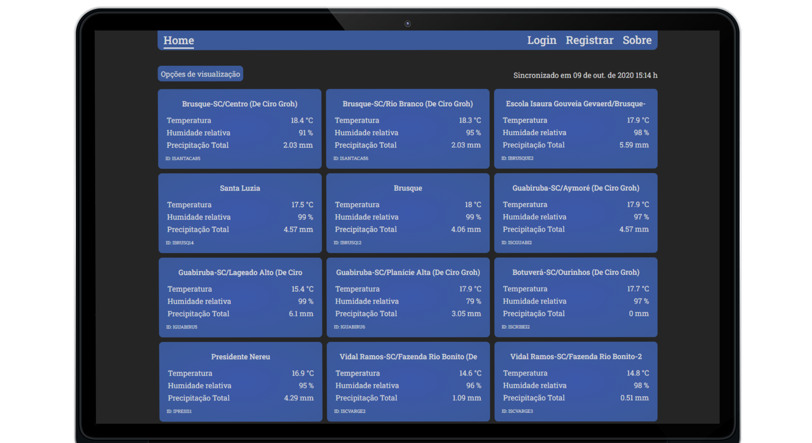

<h1 align="center">
  
</h1>

<h3 align="center">
  App to show weather conditions on any given places
</h3>

The best way to keep track of weather on your region!

  

  

  

  

  

  

  <a href="#%EF%B8%8F-about-the-project">About the project</a>&nbsp;&nbsp;&nbsp;|&nbsp;&nbsp;&nbsp;
  <a href="#-technologies">Technologies</a>&nbsp;&nbsp;&nbsp;|&nbsp;&nbsp;&nbsp;
  <a href="#-license">License</a>

  

## 💇🏻‍♂️ About the project

This app provides weather information with ease, linked to the world famous website [Weather Underground](https://www.wunderground.com/).

 - Users can choose their favorite weather stations to keep track of.

 - All sort of view options are provided to improve data analysis.

## 🚀 Technologies

Technologies used to develop this application

|                         API                        |                            Web                            |
|:--------------------------------------------------:|:---------------------------------------------------------:|
| [Node.js](https://nodejs.org/en/)                  | [ReactJS](https://reactjs.org/)                           |
| [TypeScript](https://www.typescriptlang.org/)      | [Typescript](https://www.typescriptlang.org/)             |
| [Express](https://expressjs.com/pt-br/)            | [Axios](https://github.com/axios/axios)                   |
| [TypeORM](https://typeorm.io/#/)                   | [Styled-components](https://styled-components.com/)       |
| [JWT-token](https://jwt.io/)                       | [React-icons](https://react-icons.github.io/react-icons/) |
| [uuid v4](https://github.com/thenativeweb/uuidv4/) | [React-spring](https://www.react-spring.io/)              |
| [PostgreSQL](https://www.postgresql.org/)          | [Unform](https://github.com/Rocketseat/unform)            |
|                                                    | [uuid v4](https://github.com/thenativeweb/uuidv4/)        |
|                                                    | [Yup](https://www.npmjs.com/package/yup)                  |

## 📝 License

This project is unlicensed under Copyrights © - see the [LICENSE](LICENSE.md) file for details.

---

Made with 💙 &nbsp;by Cassio Groh 👋 &nbsp;[See my linkedin](https://www.linkedin.com/in/cassiogroh/)